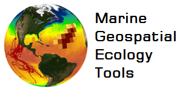

GeoEco - Marine Geospatial Ecology Tools
========================================

**GeoEco** is the open source (`BSD-3-Clause
<https://opensource.org/licenses/bsd-3-clause>`_) Python library that
implements **Marine Geospatial Ecology Tools (MGET)**. MGET helps researchers
access, manipulate, and analyze ecological and oceanographic data. MGET can be
accessed through the GeoEco Python API or an associated ArcGIS geoprocessing
toolbox.

MGET was developed by the Duke University `Marine Geospatial Ecology Lab
<https://mgel.env.duke.edu/>`_.

.. Note:: 
   This documentation is under construction and likely to be unstable until
   this note is removed.

.. toctree::
   :maxdepth: 2
   :caption: Reference

   PublicAPI
   InternalAPI
